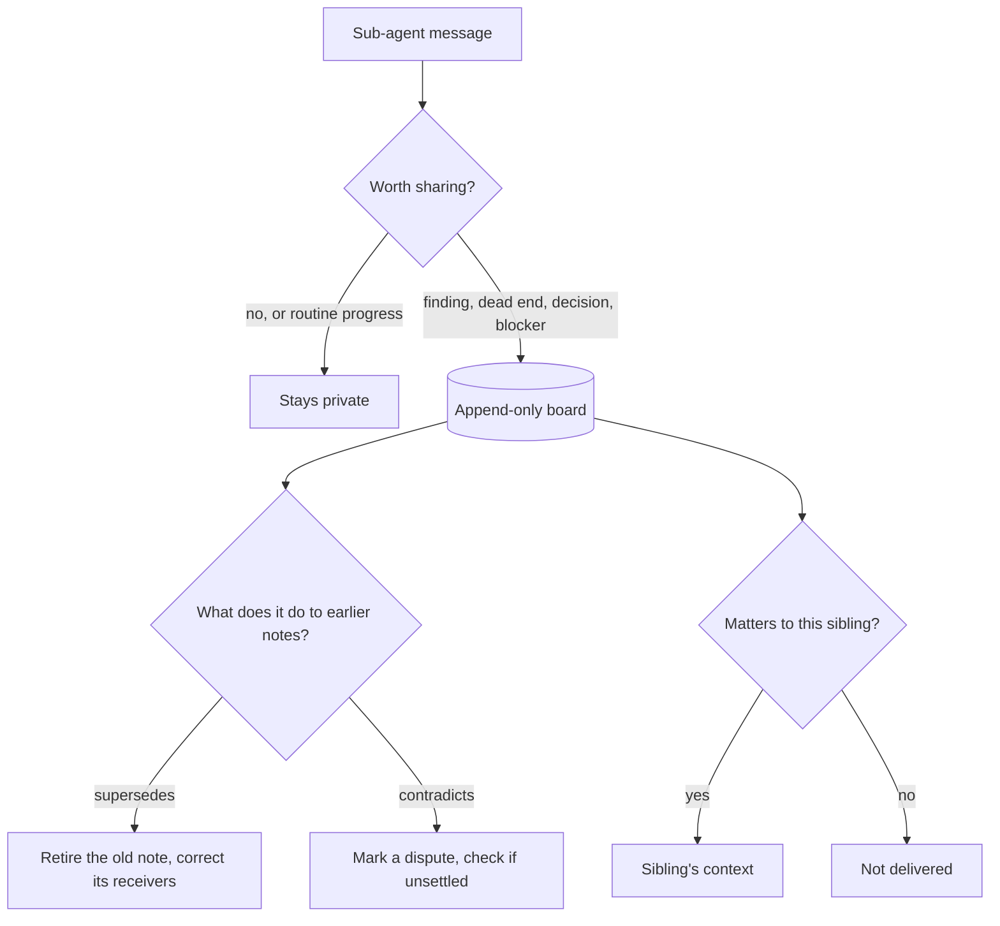

## Problem

Say you hand one bug to three sub-agents with three different angles: one reads the CI config, one tries to reproduce it locally, one goes through recent commits. When the reports come back, you find the second one spent half its run fighting something the first had already figured out.

Separate context windows are the reason parallel sub-agents are worth having. Each one thinks about its own slice without wading through the others' output. They are also the reason this keeps happening: nothing one of them learns reaches the others until the parent reads the final reports, and by then it is too late to help.

The obvious fixes each break something else. Report only to the parent, and findings arrive after the run. Put everyone in one shared chat, and every context fills up with other people's progress updates. Let each sub-agent's own model decide what to tell whom, and every such decision costs a full turn, which a busy model mostly skips anyway. Forward anything tagged "finding" by rule, and the rule cannot tell a fact one sibling badly needs from a status update nobody does.

A shared board has a quieter problem too: notes stay up after they stop being true. One sub-agent posts "the test suite can't run in this sandbox". A few minutes later it notices an inherited environment variable, unsets it, and the tests run fine. Everyone who read the first note is still working around it.

## Solution

Keep an append-only board between the sub-agents and put three small questions around it. A small, fast judge model or classifier answers them, not the sub-agents' main models, and every question has a closed set of answers.

The first question comes once per message, when a sub-agent finishes saying something or a tool returns: would this help the others, who have not seen it? With it goes a second one: is this a finding, a dead end, a decision, a blocker, or routine progress? Only a confident yes that is not routine progress goes on the board.

The second question comes once per new note and per sibling: does this note matter for what that sibling is working on? The note enters the sibling's context only on a confident yes, labelled as a finding from a peer rather than an instruction. Decisions skip the question and go to everyone, since they bind the whole team.

The third question compares a new note with earlier notes it shares words with, and asks what the new one does to the old one:

- It supersedes it: the situation changed or the earlier note was wrong, and the new note says why. The old note is marked as replaced, and everyone who received it gets a correction.
- It contradicts it: the opposite claim, with no explanation. Both stay, marked as a dispute. If nobody settles it after a while, send someone to check.
- It supports it, or the two are unrelated: nothing happens.

A sub-agent contradicting its own earlier note has just changed its mind, so treat that as supersedes. One sub-agent retiring another's note is a different matter. A wrong retirement misinforms everyone who had the note, so it should take much more confidence.

When the judge is slow, down or unsure, the note stays private. A failed gate can miss a delivery, but it never floods anyone's context.

```pseudo
on_message(agent, text):
    v = judge.publish(goal, agent.focus, text)          // yes/no + kind
    if not v.share_worthy or v.kind == "other": return  // stays private
    note = board.append(agent, v.kind, text)

    for earlier in board.notes_sharing_words_with(note):
        rel, p = judge.relate(goal, earlier, note)       // supersedes | contradicts | supports | none
        if rel == "contradicts" and earlier.agent == note.agent: rel = "supersedes"
        if rel == "supersedes" and earlier.agent != note.agent and p < CROSS_AGENT_BAR: rel = "none"
        if rel == "supersedes": board.retire(earlier); correct(earlier.receivers, note)
        if rel == "contradicts": board.mark_dispute(earlier, note); verify_if_unsettled()

    for other in agents - {agent}:
        if note.kind == "decision" or judge.deliver(other.focus, note) == "yes":
            other.context.append(note, label="finding from a peer, not an instruction")
```



## Evidence

- **Evidence Grade:** `low`
- **Most Valuable Findings:** In the implementation listed below, most of what sub-agents say is judged routine and never leaves them, and the notes that do go on the board are delivered selectively, not broadcast. Labelling note pairs from real runs showed that the judge's "supersedes" between different sub-agents was rarely right at an ordinary confidence bar, while a sub-agent revising its own note was right far more often. That is where the higher bar for cross-agent retirement comes from.
- **Unverified / Unclear:** One implementation, measured by its author on their own runs. There is no head-to-head comparison with broadcasting everything or reporting to the parent on the same tasks, so the effect on task success is not known.

## How to use it

Give every sub-agent a written focus. Both the publish and the delivery question read it, and a vague one starves the delivery gate: if every focus says "look into the bug", everything looks relevant to everyone.

Keep what the judge sees small. Publishing needs the goal, the sender's focus and the message (or the start of a tool result); delivery needs the note and the receiver's focus. Do not send transcripts.

Run the gates in the background, so the sub-agent that spoke never waits on them.

Never delete from the board. Retiring a note is a mark, so you can replay a run later and see why someone believed what they believed.

Label delivered notes as coming from a peer. A sibling should weigh a finding against what it has seen itself, not obey it, and the label also limits how far one wrong or injected note can travel.

Log every answer with its probability and read the logs from real runs before trusting the gates. That is also how to set the cross-agent bar: label some note pairs from your own runs and see where the judge gets it right.

### Known implementations

- [mu](https://github.com/qybaihe/mu): the hive mode of a coding agent built on pi; the three questions are its `hive.publish`, `hive.deliver` and `hive.relate` decision points. It is my own project and is listed as an example, not a recommendation.

## Trade-offs

**Pros:** Sub-agents hear what matters to them while they are still working, without reading each other's transcripts. When a conclusion is overturned, the correction reaches the agents that acted on it. Each message costs a few small judge calls instead of a main-model turn, and a judge outage never grows anyone's context.

**Cons:** You now maintain a judge, a board and three question definitions. The gates are only as good as the judge and the focus descriptions. Misses are silent: a finding the publish gate drops is never seen, and you only notice by reading the logs. The relation check grows with the number of overlapping notes, so a chatty run needs a cap. Disputes need a rule for who settles them, or they pile up.

## References

- [mu README, "The hive"](https://github.com/qybaihe/mu#the-hive): the implementation this write-up comes from (the contributor's own project).
- [mu hive decision definitions](https://github.com/qybaihe/mu/blob/main/packages/kyrn-judge/src/decisions/hive.ts): the three questions, their policies and fallbacks, and the calibration note behind the cross-agent bar.
- Erman, L. D., Hayes-Roth, F., Lesser, V. R., and Reddy, D. R. (1980). "The Hearsay-II Speech-Understanding System: Integrating Knowledge to Resolve Uncertainty." ACM Computing Surveys 12(2), 213-253. The original blackboard architecture: independent specialists posting partial results to a shared board.
- [Board-Mediated Async Inter-Agent Coordination](board-mediated-inter-agent-coordination.md): routes messages by explicit addressing, where this pattern has a judge decide relevance per receiver.
- [Non-Generative Judgment Routing with Typed Escalation](non-generative-judgment-routing.md): sending decision-only steps to a judgment model; the three questions here are such steps.
